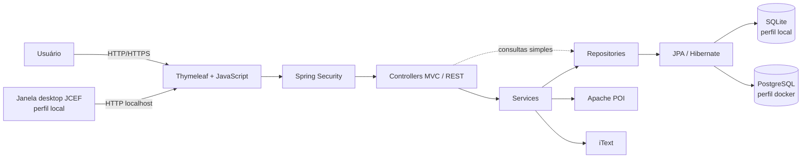
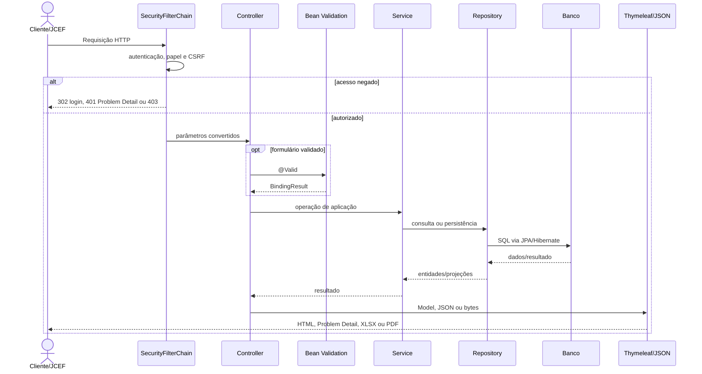
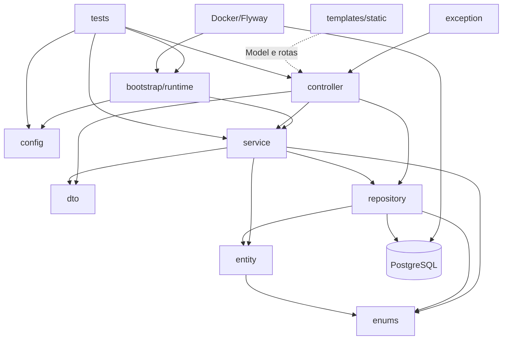

# Arquitetura

## Estilo arquitetural

O projeto é um monólito modular Spring Boot, renderizado no servidor, organizado por camadas técnicas. O processo contém servidor HTTP, regras de negócio, persistência, autenticação e geração de relatórios. No perfil local, o mesmo processo também cria uma janela desktop JCEF que navega para o servidor embutido.

Não há frontend SPA, serviço de autenticação separado, mensageria ou API pública de domínio. A API JSON em `/api` é auxiliar à própria interface.

## Camadas e responsabilidades

### Inicialização e runtime

| Componente | Responsabilidade |
|---|---|
| `ControleServicoApplication` | configura UTF-8, habilita ambiente gráfico, registra o bootstrap local e inicia o Spring |
| `LocalDatabaseBootstrapper` | executa o bootstrap de SQLite apenas quando o perfil `local` está ativo |
| `DatabaseBootstrapper` | resolve diretórios, define `APP_DB_PATH`, cria o arquivo SQLite e habilita WAL |
| `DesktopLauncher` | no perfil `local`, inicializa JCEF, abre a janela Swing e gerencia downloads |
| `JcefRuntimeInstaller` | utilitário chamado pelo build do MSI para preparar e validar o runtime JCEF offline |

### Apresentação

Os controllers recebem parâmetros HTTP, acionam validação, preparam o `Model`, delegam regras e escolhem views ou respostas binárias/JSON.

- Controllers MVC: autenticação, dashboard, chamados, relatórios e cadastros.
- `ApiRestController`: listas JSON para os seletores da interface.
- Templates Thymeleaf: HTML renderizado no servidor, controle visual por papel e formulários com CSRF integrado.
- CSS: tokens, layout, componentes e animações.
- JavaScript nos templates: gráficos, datas, modais, menu e busca assíncrona de equipamentos.

Há acesso direto a repositories em `ConfiguracoesController`, `ApiRestController` e parcialmente em `ChamadoController`. Portanto, a separação Controller → Service → Repository é predominante, mas não absoluta.

### Aplicação e negócio

Os services concentram operações transacionais:

| Service | Responsabilidade |
|---|---|
| `ChamadoService` | filtros, abertura, edição, transição de status, histórico, exclusão e reincidência |
| `DashboardService` | consolidação de KPIs, séries, rankings e chamados recentes |
| `PrestadorService` | consulta, criação, ativação e desativação de prestadores |
| `EquipamentoService` | consulta por prestador, criação e exclusão de equipamentos |
| `RelatorioExcelService` | geração de workbook XLSX por prestador |
| `RelatorioPdfService` | geração de PDF consolidado por prestador |

Services de domínio são `readOnly` por padrão e sobrescrevem com `@Transactional` nas operações de escrita. Os geradores de relatório fazem apenas leitura, mas não possuem anotação transacional própria.

### DTOs

- DTOs de entrada (`ChamadoForm`, `AlterarStatusForm`, `PrestadorForm`, `EquipamentoForm`, `SetorForm`, `MotivoForm`) evitam vincular formulários diretamente às entidades e concentram validações de formato/presença.
- DTOs de saída (`DashboardKpiDto`, `ChamadoResumoDto`) preparam dados específicos para apresentação e evitam expor o grafo JPA completo.

### Persistência

Repositories estendem `JpaRepository`. `ChamadoRepository` contém JPQL para filtros paginados, relatórios, indicadores e reincidência. `LEFT JOIN FETCH` e `@EntityGraph` carregam explicitamente associações necessárias, pois `spring.jpa.open-in-view=false` nos dois perfis.

### Tratamento de erros

- `GlobalExceptionHandler` converte exceções MVC em páginas com status 400, 404, 409 ou 500.
- `ApiExceptionHandler` converte erros da API auxiliar em `application/problem+json`.
- O Spring Security diferencia uma chamada anônima à API (401 JSON) de uma chamada MVC (redirecionamento para login).

## Fluxo de uma requisição

## Dependência entre módulos

`exception → controller` representa o escopo dos advices sobre exceções originadas durante o processamento dos controllers, não uma importação Java direta para todos eles.

## Padrões utilizados

| Padrão | Aplicação concreta |
|---|---|
| MVC server-side | controllers retornam nomes de templates Thymeleaf |
| Layered architecture | controller, service, repository e entity/dto |
| Repository | Spring Data abstrai CRUD e JPQL |
| DTO/Form Object | entrada validada e projeções específicas de view |
| Dependency Injection | dependências finais injetadas por construtor gerado pelo Lombok |
| Transaction Script/Service Layer | cada método de service coordena uma unidade de trabalho |
| Post/Redirect/Get | POSTs bem-sucedidos redirecionam e usam flash attributes |
| Soft delete parcial | prestadores são desativados; demais exclusões expostas são físicas |
| Audit trail de domínio | `ChamadoHistorico` registra criação e transições de status |
| Profiles | `local` seleciona SQLite/JCEF; `docker` seleciona PostgreSQL/Flyway |
| Database migration | Flyway versiona o schema PostgreSQL |
| Externalized configuration | credenciais e conexão vêm de ambiente/secrets |
| Problem Details | erros REST seguem o formato `ProblemDetail` |

## Decisões arquiteturais observáveis e seus efeitos

### Monólito renderizado no servidor

Controllers e templates estão no mesmo artefato. Isso reduz o número de processos e contratos distribuídos necessários para uma ferramenta interna. O custo é o acoplamento entre nomes de atributos do `Model`, rotas e templates.

### Duplo modo de execução

Os profiles permitem que o usuário local receba uma experiência instalável com SQLite, enquanto o servidor usa PostgreSQL e containers. O efeito colateral é haver dois mecanismos de evolução de schema: Hibernate `update` no SQLite e Flyway no PostgreSQL. Toda mudança persistente precisa considerar ambos para evitar divergência.

### `open-in-view=false`

O projeto não mantém a sessão Hibernate aberta durante a renderização. Isso impede consultas lazy implícitas nos templates e torna o acesso a dados mais previsível. Por esse motivo, consultas de apresentação usam fetch joins ou entity graphs.

### Regras transacionais em services

Criação, edição, status e exclusão de chamados são atômicos. O histórico inicial e as mudanças de estado participam da mesma transação da entidade principal. Controllers que gravam setor/motivo diretamente no repository executam operações individuais e não possuem uma camada de serviço própria.

### Contas em memória e configuração externa

Não há tabelas de usuário. As duas contas são recriadas a cada inicialização a partir do ambiente ou de secrets, atendendo a um modelo simples de operação interna. Esse desenho não oferece gestão de usuários, recuperação de senha, bloqueio ou auditoria individual além do nome autenticado na sessão.

### Banco não exposto no Docker

O PostgreSQL participa apenas da rede interna `backend` e não possui `ports`. Isso reduz a superfície de rede. Administração externa exige `docker compose exec`, uma ferramenta dentro da rede Docker ou uma alteração operacional deliberada do Compose.

### Dependências de UI via CDN

Fontes, ícones, gráficos, Alpine.js e Flatpickr são obtidos de serviços externos pelo navegador. O JAR/MSI inclui o runtime JCEF, mas não inclui essas bibliotecas web; consequentemente, a renderização completa depende de conectividade, cache ou espelhamento externo não presente no código.

