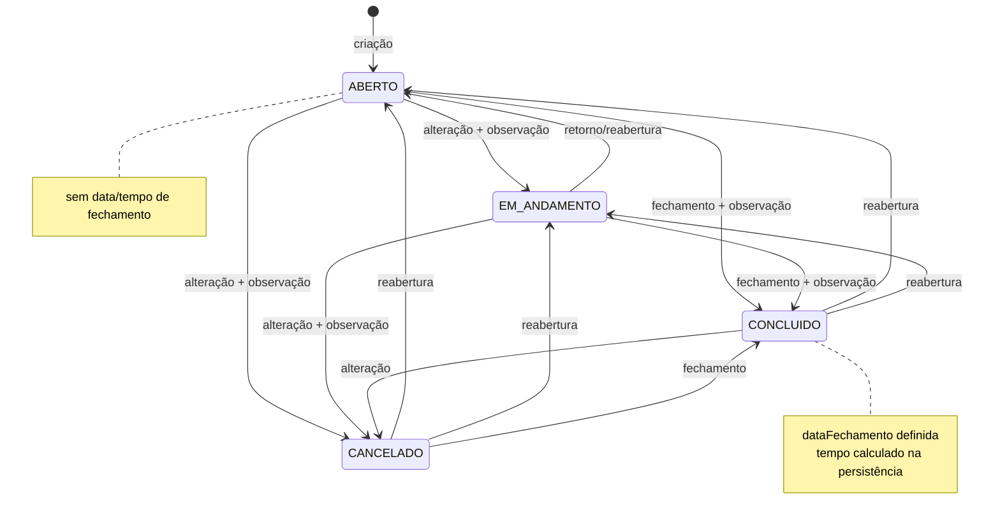

# Regras de negócio

## Chamado

Um chamado representa um atendimento de um prestador a um setor por um motivo. O equipamento é opcional. O chamado mantém status, datas, duração, conceito de avaliação, observações e um contador persistido de ocorrências do mesmo serviço.

### Dados obrigatórios e opcionais

- Obrigatórios: prestador, setor, motivo, descrição do atendimento e data/hora de abertura.
- Opcionais: número CH externo, equipamento, conceito e observação.
- O número CH possui até 50 caracteres e não é chave nem único; o ID interno identifica o registro.
- A descrição aceita até 10.000 caracteres; a observação do chamado, até 5.000.
- Se houver equipamento, ele deve pertencer ao prestador selecionado. A regra é validada no service, não apenas na interface.
- IDs de prestador, equipamento, setor e motivo precisam existir.

## Fluxo do chamado

O código aceita qualquer mudança para um status diferente do atual; não existe uma matriz que proíba, por exemplo, `ABERTO → CANCELADO` ou `CANCELADO → EM_ANDAMENTO`.

As setas representam as transições aceitas pelo service atual: qualquer estado pode mudar para qualquer outro, exceto para ele mesmo.

## Abertura

1. O formulário é validado.
2. As referências são buscadas no banco.
3. Se houver equipamento, sua propriedade é comparada com o prestador escolhido.
4. O service força `status=ABERTO`, `dataFechamento=null` e `tempoAtendimentoMinutos=null`, independentemente de qualquer estado externo.
5. A reincidência é calculada.
6. O chamado é persistido.
7. Um histórico é criado com `statusDe=null`, `statusPara=ABERTO` e observação `Chamado criado.`.

Chamado e histórico são gravados na mesma transação.

## Alteração de dados

A edição pode alterar número CH, prestador, equipamento, setor, motivo, descrição, abertura, conceito e observação. Ela não altera diretamente o status nem a data de fechamento.

- Enviar `equipamentoId` vazio remove uma associação anterior.
- Prestadores/equipamentos inativos atualmente associados são mantidos nas opções da tela de edição.
- A reincidência é recalculada após a mudança das referências/datas.
- Em chamado concluído, a nova abertura não pode ficar depois do fechamento existente.
- A edição não cria registro de histórico; somente criação e mudança de status criam.

## Fechamento

O fechamento ocorre ao mudar o status para `CONCLUIDO`.

- A observação da mudança é obrigatória.
- `dataFechamento` pode ser informada; quando ausente, usa `LocalDateTime.now()` do servidor.
- O fechamento não pode ser anterior à abertura.
- O callback JPA calcula `tempoAtendimentoMinutos` como a duração inteira em minutos entre abertura e fechamento.
- A mudança é registrada em `chamado_historico`.

O conceito de avaliação não é exigido para concluir e pode ser preenchido durante criação/edição, inclusive antes do fechamento.

## Reabertura

Não existe status chamado `REABERTO`. Reabrir significa mudar um chamado concluído ou cancelado para `ABERTO` ou `EM_ANDAMENTO`.

- O novo estado deve ser diferente do atual.
- A observação é obrigatória.
- Qualquer novo status diferente de `CONCLUIDO` limpa `dataFechamento` e `tempoAtendimentoMinutos`.
- A transição anterior/nova é persistida no histórico.

Essa mesma limpeza é aplicada a todas as transições para `ABERTO`, `EM_ANDAMENTO` ou `CANCELADO`, não apenas a reaberturas.

## Cancelamento

Mudar para `CANCELADO` exige observação e remove dados de fechamento. Um chamado cancelado é considerado finalizado por `isFinalizado()`, mas `tempoFormatado()` não calcula tempo em aberto para ele.

## Tempo de atendimento

- Fechado com intervalo válido: duração persistida em minutos.
- Aberto/em andamento sem fechamento: duração calculada em memória desde a abertura e exibida com `(em aberto)`.
- Cancelado sem duração ou duração menor/igual a zero: exibe travessão.
- Formatação: minutos abaixo de 60; horas e minutos acima disso.

O dashboard calcula a média somente sobre valores persistidos não nulos, portanto chamados ainda abertos não entram no tempo médio.

## Reincidência

O serviço é considerado o mesmo quando coincidem:

- equipamento;
- motivo;
- prestador.

Na criação/edição, o repository conta chamados com essa combinação cuja `dataAbertura` seja posterior ou igual a `agora - 90 dias`, exclui o próprio ID e soma 1 para representar o chamado atual.

- Sem equipamento: contador `0` e nunca reincidente.
- Primeiro caso encontrado: contador `1`.
- Contador igual ou superior a `2`: `isReincidente() = true`.

O corte usa o relógio atual do servidor, não a data de abertura do chamado como referência. O contador fica armazenado e só é recalculado ao criar ou editar aquele chamado; criar outro registro não atualiza retroativamente os anteriores.

## Histórico

- A criação gera o primeiro evento.
- Cada alteração válida de status gera um evento com estado anterior, novo estado, observação e timestamp do Hibernate.
- Eventos são exibidos do mais recente para o mais antigo.
- Alterações em campos comuns não entram no histórico.
- Exclusão administrativa remove os históricos e depois o chamado dentro da mesma transação.

## Consulta de chamados

Todos os filtros são opcionais e combinados com `AND`: prestador, status, setor, motivo, equipamento, abertura, conceito e trecho do número CH.

- O trecho do número é comparado sem diferenciar caixa.
- O período é semiaberto internamente e inclui todo o dia final fornecido.
- Página mínima: `0`; tamanho: 1 a 100.
- Ordenação permitida somente por `id`, `numeroCh`, `dataAbertura`, `dataFechamento`, `status` e `createdAt`.

## Dashboard

O filtro opcional de prestador é aplicado a todas as consultas do dashboard. O ID precisa existir, mas o service não exige que o prestador esteja ativo.

| Indicador | Regra exata |
|---|---|
| Chamados no mês | abertura desde o primeiro dia do mês atual até o primeiro dia do próximo mês |
| Abertos | total histórico em `ABERTO` |
| Em andamento | total histórico em `EM_ANDAMENTO` |
| Concluídos | total histórico em `CONCLUIDO` |
| Cancelados | total histórico em `CANCELADO`; calculado no DTO, mas não possui card próprio no template |
| Taxa de reincidência | percentual de chamados com contador ≥ 2 entre o início do mês de 11 meses atrás e agora |
| Tempo médio | média histórica dos minutos persistidos, convertida em horas |
| Chamados por prestador | contagem no período de 12 meses usado pelo dashboard; prestadores ativos aparecem mesmo com zero |
| Evolução mensal | seis meses, cada um em seu intervalo mensal |
| Top 5 motivos | contagem histórica, sem corte temporal, limitada a cinco |
| Recentes | dez registros ordenados por `createdAt` decrescente |

Taxa e tempo são arredondados para uma casa decimal. Quando não há denominador/dados, o valor é `0.0`.

## Relatórios

### Seleção e período

- Data inicial e final são obrigatórias.
- A data final não pode anteceder a inicial.
- O controller converte o período para início inclusivo e dia posterior ao fim exclusivo.
- Se nenhum prestador for enviado, todos os prestadores ativos são usados.
- Cada prestador solicitado precisa existir.
- Chamados são ordenados por data de abertura crescente.

### Excel

- Uma planilha por prestador.
- IDs repetidos são processados uma vez.
- Nome de aba é sanitizado para o formato XLSX, limitado a 31 caracteres e tornado único sem diferenciar caixa.
- Colunas incluem identificação, datas, equipamento, setor, motivo, descrição, tempo, status, ocorrências, cinco conceitos e observação.
- O conceito selecionado recebe `X` na coluna correspondente.
- Uma linha de total é adicionada quando há chamados.

### PDF

- Um documento A4 paisagem, com seção e tabela por prestador.
- Se não houver chamados, a seção informa isso.
- IDs repetidos na lista não são removidos pelo service PDF e geram seções repetidas.
- O cabeçalho informa o período recebido; como o controller passa o fim exclusivo, o texto formatado pelo service mostra a data seguinte à data final selecionada. Os dados consultados, contudo, respeitam o dia final inclusivo.

## Prestadores

- Nome obrigatório, máximo 255 e único no banco.
- Descrição opcional, limitada a 2.000 no formulário.
- Novos registros são ativos.
- Desativar preserva o registro e o histórico relacionado.
- Prestadores inativos deixam de aparecer nas listas padrão, novos chamados, filtros ativos e seleção automática de relatórios.
- Reativação restaura a participação nessas listas.
- Não há endpoint de edição de nome/descrição nem de exclusão física.

## Equipamentos

- Prestador e nome são obrigatórios; modelo e número de série são opcionais.
- Nome/modelo/número de série possuem máximo de 255 no formulário.
- Nome é único apenas dentro do mesmo prestador.
- Novos equipamentos são ativos.
- A tela oferece criação e exclusão física, mas não edição nem ativação/desativação.
- O filtro administrativo por prestador usa somente equipamentos ativos; sem filtro, lista todos, inclusive inativos.
- Exclusão de equipamento referenciado por chamado é impedida pela integridade do PostgreSQL e tratada como conflito.

## Setores e motivos

- Setor: nome obrigatório, máximo 255, único, criado ativo.
- Motivo: descrição obrigatória, máximo 255 e única.
- Ambos podem ser excluídos fisicamente pela área administrativa.
- Registros referenciados por chamados não podem ser excluídos quando o banco aplica as FKs.

