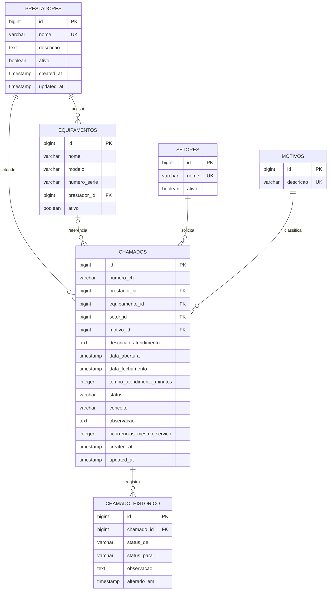

# Banco de dados

## Visão geral

O modelo persistente possui seis entidades JPA. `Chamado` é o agregado operacional central; prestador, equipamento, setor e motivo fornecem classificação; `ChamadoHistorico` registra a trilha de mudanças de status.

Há duas implementações configuradas:

- **SQLite/local**: schema mantido pelo Hibernate com `ddl-auto: update`; Flyway desativado; carga `db/seed/sqlite-data.sql`.
- **PostgreSQL/docker**: schema criado por Flyway; Hibernate apenas valida com `ddl-auto: validate`; carga comum em `V2__seed_data.sql`.

## Diagrama ER

O diagrama representa o modelo definido pelas entidades e pela migration PostgreSQL.

## Entidades e tabelas

### `Prestador` / `prestadores`

Representa a empresa que presta o serviço e é responsável por equipamentos e chamados.

| Campo Java | Coluna | Tipo PostgreSQL | Obrigatório | Regra |
|---|---|---|---|---|
| `id` | `id` | `BIGINT IDENTITY` | sim | chave primária |
| `nome` | `nome` | `VARCHAR(255)` | sim | único |
| `descricao` | `descricao` | `TEXT` | não | descrição livre |
| `ativo` | `ativo` | `BOOLEAN` | sim | padrão `true` na entidade/migration |
| `createdAt` | `created_at` | `TIMESTAMP(6)` | não | preenchido por `@CreationTimestamp` |
| `updatedAt` | `updated_at` | `TIMESTAMP(6)` | não | atualizado por `@UpdateTimestamp` |

A interface administrativa usa desativação lógica. O service também possui exclusão física, mas não há endpoint para ela no controller atual.

### `Equipamento` / `equipamentos`

Representa um item atendido e pertence obrigatoriamente a um prestador.

| Campo Java | Coluna | Tipo PostgreSQL | Obrigatório | Regra |
|---|---|---|---|---|
| `id` | `id` | `BIGINT IDENTITY` | sim | chave primária |
| `nome` | `nome` | `VARCHAR(255)` | sim | único dentro do prestador |
| `modelo` | `modelo` | `VARCHAR(255)` | não | texto livre |
| `numeroSerie` | `numero_serie` | `VARCHAR(255)` | não | texto livre; não é único |
| `prestador` | `prestador_id` | `BIGINT` | sim | FK para `prestadores.id` |
| `ativo` | `ativo` | `BOOLEAN` | sim | padrão `true` |

A constraint `uk_equipamento_nome_prestador` impede dois equipamentos com o mesmo nome no mesmo prestador. A interface atual cria e exclui fisicamente; não expõe edição nem mudança do campo `ativo`.

### `Setor` / `setores`

Representa o setor ou solicitante interno associado ao chamado.

| Campo Java | Coluna | Tipo PostgreSQL | Obrigatório | Regra |
|---|---|---|---|---|
| `id` | `id` | `BIGINT IDENTITY` | sim | chave primária |
| `nome` | `nome` | `VARCHAR(255)` | sim | único |
| `ativo` | `ativo` | `BOOLEAN` | sim | padrão `true` |

O controller cadastra setores ativos e permite exclusão física. Não há endpoint de ativação/desativação.

### `Motivo` / `motivos`

Classifica a razão do atendimento.

| Campo Java | Coluna | Tipo PostgreSQL | Obrigatório | Regra |
|---|---|---|---|---|
| `id` | `id` | `BIGINT IDENTITY` | sim | chave primária |
| `descricao` | `descricao` | `VARCHAR(255)` | sim | única |

O controller permite criação e exclusão física.

### `Chamado` / `chamados`

Registro central do atendimento.

| Campo Java | Coluna | Tipo PostgreSQL | Obrigatório | Regra |
|---|---|---|---|---|
| `id` | `id` | `BIGINT IDENTITY` | sim | chave primária |
| `numeroCh` | `numero_ch` | `VARCHAR(50)` | não | referência externa opcional; não é única |
| `prestador` | `prestador_id` | `BIGINT` | sim | FK para `prestadores.id` |
| `equipamento` | `equipamento_id` | `BIGINT` | não | FK para `equipamentos.id` |
| `setor` | `setor_id` | `BIGINT` | sim | FK para `setores.id` |
| `motivo` | `motivo_id` | `BIGINT` | sim | FK para `motivos.id` |
| `descricaoAtendimento` | `descricao_atendimento` | `TEXT` | sim | formulário limita a 10.000 caracteres |
| `dataAbertura` | `data_abertura` | `TIMESTAMP(6)` | sim | informada pelo usuário |
| `dataFechamento` | `data_fechamento` | `TIMESTAMP(6)` | não | definida somente quando concluído |
| `tempoAtendimentoMinutos` | `tempo_atendimento_minutos` | `INTEGER` | não | calculado antes de persistir/atualizar |
| `status` | `status` | `VARCHAR(255)` | sim | enum persistido como texto |
| `conceito` | `conceito` | `VARCHAR(255)` | não | enum persistido como texto |
| `observacao` | `observacao` | `TEXT` | não | formulário limita a 5.000 caracteres |
| `ocorrenciasMesmoServico` | `ocorrencias_mesmo_servico` | `INTEGER` | não | padrão lógico `0`; recalculado pelo service |
| `createdAt` | `created_at` | `TIMESTAMP(6)` | não | preenchido pelo Hibernate |
| `updatedAt` | `updated_at` | `TIMESTAMP(6)` | não | preenchido pelo Hibernate |

Valores de `status`: `ABERTO`, `EM_ANDAMENTO`, `CONCLUIDO`, `CANCELADO`.

Valores de `conceito`: `EXCELENTE`, `MUITO_BOM`, `BOM`, `REGULAR`, `INSATISFATORIO`.

A migration PostgreSQL usa `VARCHAR` sem `CHECK`; a restrição do conjunto de valores é aplicada pelo enum Java e pela conversão do Spring/JPA.

### `ChamadoHistorico` / `chamado_historico`

Registra a criação e cada transição de status.

| Campo Java | Coluna | Tipo PostgreSQL | Obrigatório | Regra |
|---|---|---|---|---|
| `id` | `id` | `BIGINT IDENTITY` | sim | chave primária |
| `chamado` | `chamado_id` | `BIGINT` | sim | FK para `chamados.id` |
| `statusDe` | `status_de` | `VARCHAR(255)` | não | `null` no evento inicial |
| `statusPara` | `status_para` | `VARCHAR(255)` | sim | novo estado |
| `observacao` | `observacao` | `TEXT` | não no banco | obrigatória no formulário de mudança; criação usa texto fixo |
| `alteradoEm` | `alterado_em` | `TIMESTAMP(6)` | não na migration | preenchido por `@CreationTimestamp` |

Não há cascade JPA declarado. Ao excluir um chamado, o service remove explicitamente os históricos antes da entidade principal.

## Relacionamentos e cardinalidade

| Origem | Destino | Cardinalidade | Propriedade |
|---|---|---|---|
| Prestador | Equipamento | 1:N | equipamento sempre possui prestador |
| Prestador | Chamado | 1:N | chamado sempre possui prestador |
| Equipamento | Chamado | 1:N opcional no lado do chamado | chamado pode existir sem equipamento |
| Setor | Chamado | 1:N | chamado sempre possui setor |
| Motivo | Chamado | 1:N | chamado sempre possui motivo |
| Chamado | Histórico | 1:N | criação/transições geram registros |

As entidades não possuem coleções reversas. Todas as associações são navegadas do chamado/equipamento/histórico para sua referência `@ManyToOne`, com carregamento `LAZY`.

## Chaves, constraints e índices PostgreSQL

### Chaves e unicidade

- PK identity em todas as tabelas.
- `prestadores.nome` único.
- `setores.nome` único.
- `motivos.descricao` única.
- `(equipamentos.nome, equipamentos.prestador_id)` único.
- FKs sem `ON DELETE CASCADE`; o comportamento padrão do PostgreSQL é restringir exclusões referenciadas.

### Índices explícitos na migration

| Índice | Coluna | Uso principal no código |
|---|---|---|
| `idx_chamados_status` | `chamados.status` | filtros e agrupamento por estado |
| `idx_chamados_prestador` | `chamados.prestador_id` | filtros, relatórios e dashboard |
| `idx_chamados_equipamento` | `chamados.equipamento_id` | filtro e cálculo de reincidência |
| `idx_chamados_setor` | `chamados.setor_id` | filtro de listagem |
| `idx_chamados_motivo` | `chamados.motivo_id` | filtro, ranking e reincidência |
| `idx_chamados_abertura` | `chamados.data_abertura` | períodos e ordenação |
| `idx_historico_chamado` | `chamado_historico.chamado_id` | timeline de um chamado |

Constraints únicas também geram índices de suporte no PostgreSQL.

## Fluxo dos dados

1. Os seeds criam prestadores, setores, motivos e equipamentos iniciais de forma idempotente.
2. O formulário de chamado envia IDs e campos simples para `ChamadoForm`.
3. `ChamadoService` resolve cada ID nos repositories e rejeita equipamento de outro prestador.
4. Na abertura, o status é forçado para `ABERTO`, fechamento/tempo são limpos e a reincidência é calculada.
5. O chamado e o histórico inicial são salvos na mesma transação.
6. Mudanças de status atualizam datas/tempo e adicionam `ChamadoHistorico`.
7. Listas e detalhes usam fetch explícito para que os templates funcionem com Open Session in View desativado.
8. Dashboard e relatórios usam consultas agregadas ou listas ordenadas por período.

## Carga inicial

Os dois bancos recebem os mesmos conjuntos lógicos:

- prestadores: AMAZONCOPY, BRASILINE e NET2PHONE;
- dez setores;
- dezenove motivos;
- nove equipamentos relacionados aos três prestadores.

O SQLite usa `INSERT OR IGNORE`. O PostgreSQL usa `INSERT ... SELECT ... WHERE NOT EXISTS`. Chamados e históricos não são semeados.

## Estado do arquivo SQLite presente no workspace

Foi feita inspeção read-only de `data/banco.db` em 19/07/2026. Esse artefato está em modo WAL e contém as seis tabelas, porém zero registros em todas elas.

O schema materializado nesse arquivo diverge do modelo atual:

- não há FKs registradas em `PRAGMA foreign_key_list`;
- `setores.nome` não possui índice único;
- equipamentos não possuem a constraint única `(nome, prestador_id)` e `prestador_id` aparece anulável;
- `chamados` possui somente os índices de status, prestador e abertura;
- faltam os índices de equipamento, setor, motivo e histórico;
- algumas colunas que são obrigatórias na entidade/migration aparecem anuláveis.

Essa constatação descreve o arquivo existente; não foi feita migração nem correção de dados nesta revisão. O PostgreSQL de produção não usa esse arquivo: seu contrato é `V1__create_schema.sql` mais validação JPA.

## Consistência e exclusão

- Excluir prestador, equipamento, setor ou motivo já referenciado pode gerar `DataIntegrityViolationException`; o MVC responde 409 com mensagem genérica.
- A interface evita apagar prestadores e usa `ativo=false`, preservando referências históricas.
- Edição de chamado inclui o prestador/equipamento atual mesmo quando inativo, para não tornar registros legados impossíveis de editar.
- Não há cascade de atualização ou remoção configurado nas associações.
- O contador de reincidência é persistido no chamado; ele é recalculado na criação e edição, não retroativamente em todos os registros relacionados.

